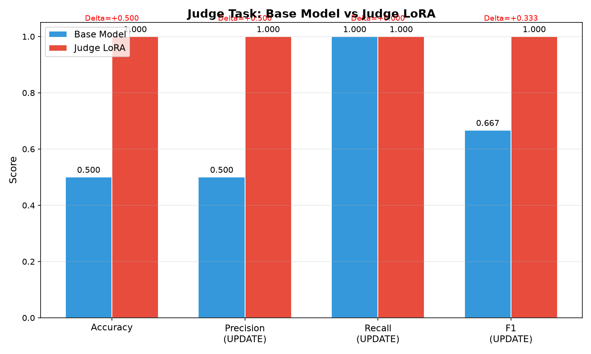
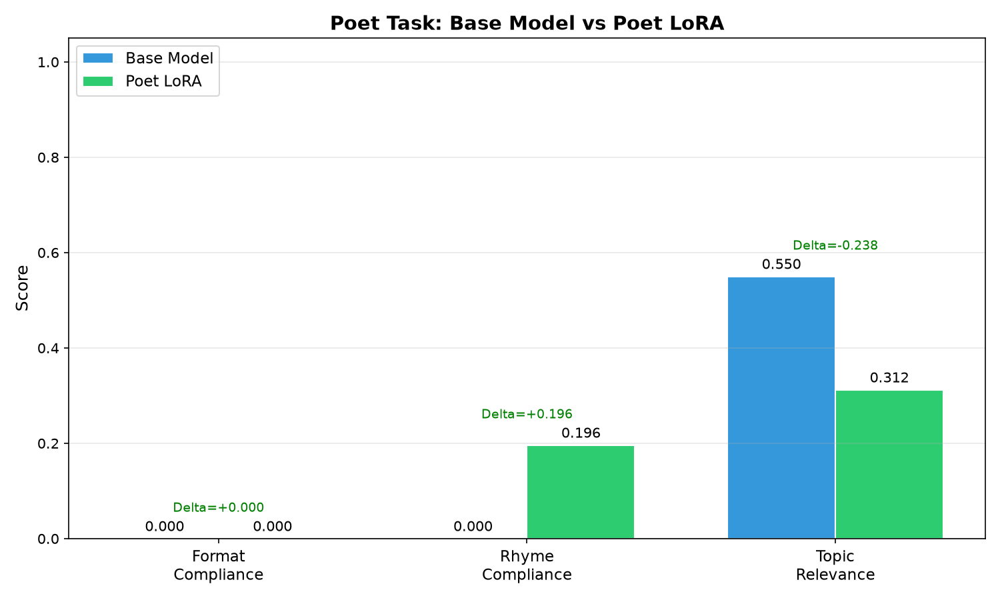
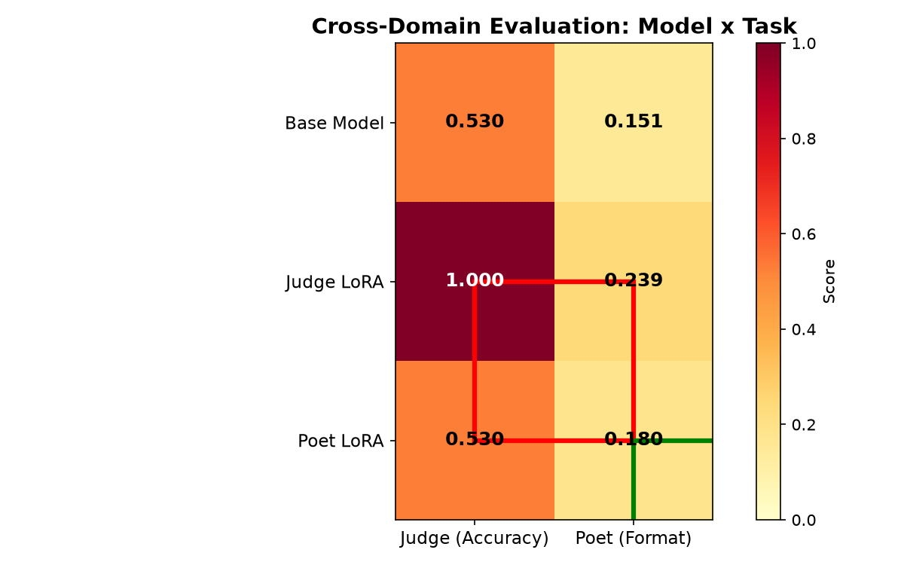

# Prism-LoRA

LoRA + vLLM 多适配器推理实验：记忆冲突检测（Judge）× 古诗写作（Poet）

## 项目简介

在 Qwen2.5-1.5B-Instruct 基座模型上微调两个领域专用 LoRA 适配器：

- **Judge LoRA**：记忆冲突检测——给定一条旧记忆和一条新事实，判断二者是否在同一维度冲突（UPDATE）或可共存（KEEP），输出结构化 JSON（decision / reason / updated_memory）
- **Poet LoRA**：古诗写作——根据主题、诗体与风格要求创作古诗，遵守平水韵押韵规范

通过 vLLM `--enable-lora` 同时加载两个适配器，使用 OpenAI-compatible API 的 `model` 参数动态切换角色。采用 2×3 交叉评测矩阵（3 个模型 × 2 个任务）验证领域专用增强与交叉隔离效果。

## 项目结构

```
prism-lora/
├── configs/                    # 配置中心
│   ├── config.yaml             # 统一配置（模型路径、vLLM 参数、API 密钥）
│   ├── config.py               # Python 配置加载器 + YAML 模板渲染
│   ├── judge_lora.yaml         # Judge LoRA 训练模板（${...} 占位符）
│   └── poet_lora.yaml          # Poet LoRA 训练模板
├── data/                       # 合成训练/验证/测试数据
│   ├── dataset_info.json       # LLaMAFactory 数据集注册（sharegpt 格式）
│   ├── judge/                  # Judge 数据（train 2000 / val 200 / test 300）
│   └── poet/                   # Poet 数据（4 诗体 × 多主题）
├── scripts/
│   ├── prepare_data.py         # Judge 数据合成（5 种样本类型 × 18 模板 × 6 输出格式）
│   ├── generate_poet_data.py   # Poet 数据生成（LLM API + 平水韵验证）
│   ├── _gen_poet_local.py      # Poet 数据备份（手写原创诗歌，无需 API）
│   ├── train_lora.py           # LoRA 训练（LLaMAFactory CLI）
│   ├── start_vllm.sh           # vLLM 多适配器服务启动
│   ├── stop_vllm.sh            # vLLM 服务停止
│   ├── query_adapter.py        # 交互式/单次推理脚本
│   ├── evaluate.py             # 评测向后兼容入口
│   └── cleanup.sh              # 清理中间文件
├── eval/                       # 评测模块
│   ├── judge_eval.py           # Judge 评测（accuracy / F1 / per-class report）
│   ├── poet_eval.py            # Poet 评测（格式 / 押韵 / 主题 / 多样性）
│   ├── cross_eval.py           # 2×3 交叉评测 + 4 条件特化判定
│   └── plot_results.py         # 可视化（对比柱状图 + 热力图）
├── inference/                  # 推理客户端
│   ├── client.py               # PrismClient 异步类（judge/poet/base 方法）
│   └── test_api.py             # API 集成测试
├── outputs/                    # 训练产出（adapter checkpoint）
├── results/                    # 评测结果
│   ├── report.md               # 完整评测报告（含分析与结论）
│   ├── *.json                  # 评测数据（judge_base/lora, poet_base/lora, cross_eval）
│   ├── judge_comparison.png    # Judge 任务对比柱状图
│   ├── poet_comparison.png     # Poet 任务对比柱状图
│   └── cross_domain_heatmap.png # 交叉领域热力图
├── run_all.sh                  # 一站式运行管线
└── requirements.txt            # 依赖声明
```

## 环境要求

- Python 3.10+
- NVIDIA GPU（16GB+ VRAM）
- CUDA 11.8+
- （可选）`ANTHROPIC_API_KEY`：使用 Claude API 生成 Poet 训练数据

## 快速开始

### 安装依赖

```bash
pip install -r requirements.txt
```

### 一站式运行

```bash
bash run_all.sh
```

自动完成：数据合成 → LoRA 训练 → vLLM 启动 → 评测 → 生成可视化与报告。

### 分步运行

```bash
# 1. 合成数据
python scripts/prepare_data.py                     # Judge 数据
ANTHROPIC_API_KEY=xxx python scripts/generate_poet_data.py  # Poet 数据（需 API Key）

# 2. 训练 LoRA（需要 GPU）
python scripts/train_lora.py --task judge
python scripts/train_lora.py --task poet

# 3. 启动 vLLM 服务（后台运行，等待就绪后继续）
bash scripts/start_vllm.sh

# 4. 评测（vLLM 服务运行中）
python -m eval.judge_eval           # Judge 任务评测
python -m eval.poet_eval            # Poet 任务评测
python -m eval.cross_eval           # 2×3 交叉评测
python -m eval.plot_results         # 生成对比图与热力图

# 5. 查看报告
cat results/report.md
```

## 交互式推理

### 命令行工具

```bash
# 交互模式：使用 /judge、/poet、/base、/quit 切换
python scripts/query_adapter.py --interactive

# 单次查询
python scripts/query_adapter.py --mode judge --input "旧记忆：张三喜欢吃苹果\n新事实：张三不喜欢吃苹果"
python scripts/query_adapter.py --mode poet --input "写一首关于秋天的七言绝句"
```

### PrismClient 异步 API

```python
from inference.client import PrismClient

client = PrismClient(base_url="http://localhost:8000/v1")

# Judge：记忆冲突检测
result = await client.judge("张三喜欢吃苹果", "张三不喜欢吃苹果")

# Poet：古诗生成
poem = await client.poet("写一首关于秋天的七言绝句")

# 基座模型
reply = await client.base_model("你好")
```

## 评测结果

> 完整报告见 [`results/report.md`](results/report.md)

### Judge Task（记忆冲突检测）

| 模型 | Accuracy | F1(UPDATE) | F1(KEEP) | Valid/Total |
|------|----------|------------|----------|-------------|
| base (Qwen2.5-1.5B) | 0.5000 | 0.6667 | 0.0000 | 300/300 |
| **judge** | **1.0000** | **1.0000** | **1.0000** | 300/300 |
| poet (cross) | 0.5300 | 0.6928 | — | 100/100 |

> ⚠️ Judge LoRA 测试集完美准确率，疑似**过拟合/记忆答案**。

### Poet Task（古诗写作）

| 模型 | format_compliance | rhyme_compliance | topic_relevance | diversity |
|------|-------------------|------------------|-----------------|-----------|
| base (Qwen2.5-1.5B) | 0.0000 | 0.0000 | 0.5500 | 0.4014 |
| judge (cross) | 0.1802 | 0.0200 | 0.6629 | — |
| **poet** | **0.0000** | **0.1960** | 0.3120 | 0.1407 |

> Poet LoRA 押韵合规性有所提升（0→0.196），但格式合规性仍为 0，主题相关性与多样性下降。

### 交叉领域特化矩阵（100 样本子集）

| Model | Conflict(Acc) | Conflict(F1) | Poet(Form) | Poet(Rhyme) |
|-------|---------------|--------------|------------|-------------|
| Base Model | 0.5300 | 0.6928 | 0.1515 | 0.0000 |
| Judge LoRA | 1.0000 | 1.0000 | 0.1802 | 0.0200 |
| Poet LoRA | 0.5300 | 0.6928 | 0.2390 | 0.1500 |

### 可视化

| Judge 对比 | Poet 对比 | 交叉热力图 |
|:---:|:---:|:---:|
|  |  |  |

### 特化判定（4 条件）

| 条件 | 描述 | 结果 | Delta |
|------|------|:----:|-------|
| C1 | Judge LoRA 在 Judge 任务上提升 | ✅ PASS | +0.4700 |
| C2 | Poet LoRA 在 Judge 任务上不提升 | ✅ PASS | +0.0000 |
| C3 | Poet LoRA 在 Poet 任务上提升 | ❌ FAIL | +0.0875 |
| C4 | Judge LoRA 在 Poet 任务上不提升 | ✅ PASS | +0.0287 |

**结论：✗ NOT PROVEN** — Judge LoRA 过拟合导致 C1 结果不可信，Poet LoRA 改善不足导致 C3 未通过。

## 评测体系

### Judge 评测指标

- **Accuracy**：二分类准确率（UPDATE vs KEEP）
- **F1(UPDATE / KEEP)**：各类别 F1（sklearn，pos_label="UPDATE"）
- **Valid/Total**：有效预测数 / 总样本数（3 策略解析失败记为 UNKNOWN）

### Poet 评测指标

| 指标 | 说明 | 方法 |
|------|------|------|
| format_compliance | 格式合规性 | 行数 + 每行字数匹配诗体规范（加权 0.3/0.7，阈值 0.5） |
| rhyme_compliance | 押韵合规性 | 平水韵 28 韵部，偶数句末字押韵检测 |
| topic_relevance | 主题相关性 | 关键词重叠 + 扩展主题字符集匹配 |
| diversity | 多样性 | distinct-2 bigram ratio |

### 交叉评测

3 个模型（base / judge LoRA / poet LoRA）× 2 个任务（judge / poet），每个组合取 100 样本子集。4 条件判定：

1. Judge LoRA 在 Judge 任务上提升（delta > 0）
2. Poet LoRA 在 Judge 任务上不提升（|delta| < 0.05）
3. Poet LoRA 在 Poet 任务上提升（delta > 0）
4. Judge LoRA 在 Poet 任务上不提升（|delta| < 0.05）

## LoRA 训练配置

| 参数 | Judge LoRA | Poet LoRA |
|------|-----------|-----------|
| lora_rank | 16 | 32 |
| lora_alpha | 32 | 64 |
| lora_dropout | 0.05 | 0.05 |
| lora_target | all | all |
| learning_rate | 5e-4 | 3e-4 |
| num_train_epochs | 3 | 5 |
| cutoff_len | 512 | 256 |
| batch_size | 2×8 (grad_accum) | 2×8 |
| scheduler | cosine | cosine |
| warmup_ratio | 0.1 | 0.1 |
| val_size | 0.1 | 0.1 |
| flash_attn | fa2 | fa2 |
| bf16 | ✅ | ✅ |
| gradient_checkpointing | ✅ | ✅ |

所有配置通过 `configs/config.yaml` 统一管理，训练模板使用 `${...}` 占位符，由 `configs/config.py` 的 `render_yaml()` 渲染。环境变量 `PRISM_BASE_MODEL` 和 `PRISM_VLLM_PORT` 可覆盖默认值。

## 数据合成

### Judge 数据（`scripts/prepare_data.py`）

5 种样本类型，2000 训练 / 200 验证 / 300 测试：

| 类型 | 占比 | 说明 |
|------|------|------|
| update_conflict | 35% | 同维度冲突（喜好反转 80% + 数值更新 20%） |
| update_attribute | 10% | 技能属性反转 |
| keep_different_dimension | 25% | 同属性不同对象，可共存 |
| keep_different_domain | 15% | 完全不同领域，可共存 |
| contextual_update | 15% | 多句叙事记忆更新 |

- 18 种输入模板（14 训练 + 4 仅测试，保证泛化性测试）
- 6 种输出格式（JSON / 自然语言 / 结构化文本 / 简洁 / 解释 / Markdown）
- 实体池：50 人名、30 城市、25 公司、20 学校、30 地点、20 事件

### Poet 数据（`scripts/generate_poet_data.py`）

- 通过 OpenAI-compatible API（默认 GLM-4-flash，可配置）生成原创古诗
- 4 种诗体（五言绝句 / 七言绝句 / 五言律诗 / 七言律诗）× 43 主题 × 5 种诗人风格
- 4 阶段验证：非空 → 格式合规 → 平水韵押韵 → 原创性（对 POEMS_DB 去重）
- JSONL 缓存支持断点续传，输出 train/val/test 切分（70/12/18%）

## 已知问题与改进方向

1. **Judge LoRA 过拟合**：测试集 1.0 准确率，模型可能记忆了训练数据答案模式而非学习冲突检测逻辑
   - 使用独立保留测试集重新评估
   - 增加训练数据多样性（更多模板、更多实体类型）
   - 添加正则化（增大 dropout、增加 weight decay）
2. **Poet LoRA 效果有限**：格式合规性近乎 0，仅押韵有轻微改善
   - 增加训练数据量与诗体覆盖（律诗数据不足）
   - 考虑更大的 LoRA rank 或多阶段训练
   - 引入格式奖励信号（RLHF / DPO）
3. **评测管线不完整**：`report.md` 尚未集成到自动评测流程
   - 将报告生成集成到 `eval/plot_results.py` 或新建 `eval/report_gen.py`
   - 从 JSON 数据自动填充数值，避免手工维护

## 技术栈

| 组件 | 技术 |
|------|------|
| 基座模型 | Qwen2.5-1.5B-Instruct |
| 训练框架 | LLaMAFactory (SFT + LoRA) |
| 推理引擎 | vLLM（多适配器模式，`--enable-lora`） |
| 评测 | scikit-learn + 自定义指标（平水韵、格式合规、主题匹配） |
| 数据生成 | Claude API / GLM-4-flash |
| 可视化 | matplotlib (YlOrRd colormap) |
| 异步推理 | openAI Python SDK (async) |